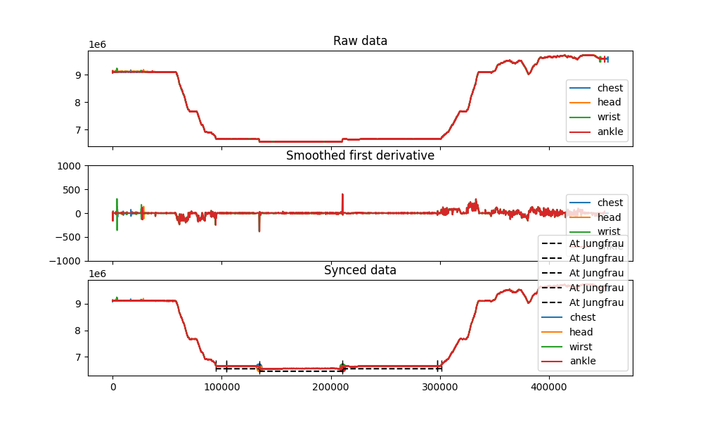

# Project 1

## Task 1

```
-----------
Question 1.1:
-----------
Shortest sensor log: ankle
Total duration: 451008
Duration at Jungfrau: 206956
Portion of trip spent in Jungfrau: 45.89 %
-----------
Question 1.2 : Samples removed from the beginning of:
-----------
Wirst sensor: 51
Head sensor: 120
Ankle sensor: 173
```



## How to run

``` bash
cd /project_1
python3 task1.py
```

## Question 1: 

**Objective**: Find percentage of the total recorded time did the subject spend at Jungfraujoch (time between arrival and departure)? You may use the length of the shortest data trace as base value for 100%.

**Observation**:
* From research: the maximum air pressure at Jungfraujoch during 01.12.2020 to 23.01.2020 is: 

**Idea 1**: 
* Thresholding approach: the subject it at Jungfraujoch as long as the air pressure is below a certain value.
* Assume regions of steep change correspond to transportation, the subject will be at Jungfraujoch when air pressure data shows long periods of being at a constant low value
* Method: Find plateaux on the signal and select those with an average value below the reference threshold. Find the percentage by dividing the total selected length to the shortest sensor data length

## Question 2:

**Objective**: There is a misalignment between the data traces. Shorten the traces to match the device that was turned on last so that samples of all devices are synchronous by array index. Do this as precisely as possible.

**Obesrvation**:
* From the data plots, we know that the order in which the devices were turned on is: Ankle, Head, Writst, Chest.

**Idea 1**:
* The shift between signals is most obvious when the change in pressure is high
* Get the first derivative of the signal
* Smooth it with a low pass filter
* Find peaks in the smoothed first derivative of the 4 sensors 
* Match the peaks across signals (TODO)
* Find the x-distance between the ```"chest"``` sensor peaks and the other sensors
* The signal shift from ```chest``` is the average of the shifts across all the peaks

> TODO: right now I am manually matching the peaks, but if we have a better peak matching system like nearest neighbours, then we can allow for more peaks and get a more representative average. 


## Question 3:

**Objective**: find the sampling rate of the sensor

**Observation**: 
* [ECS-.327-7-16-C-TR](https://www.digikey.com/en/products/detail/ecs-inc/ECS-327-7-16-C-TR/9597476): 	
32.768kHz ±10ppm
* The sensor sampling rate should be a multiple of this frequency

**Idea 1**: 